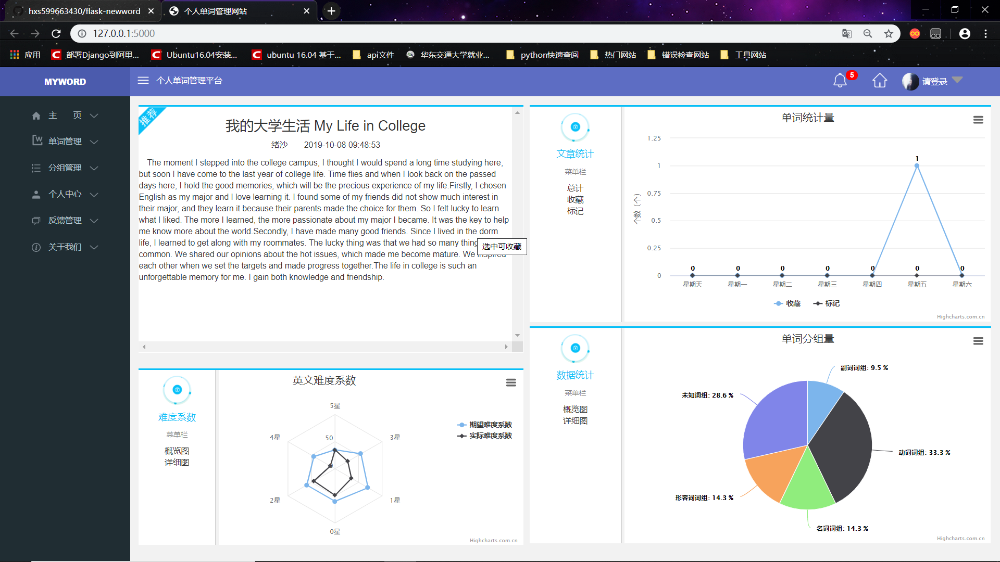

# 基于python web 微框架Flask的个人单词管理系统的设计与实现

#### 基本介绍

项目背景：对于个人可有效的管理不同等级难度的单词

技术使用：python、flask框架、MySQL、HTML5、CSS3、JavaScript、jQuery、highcharts

项目介绍：前台主要分为项目首页、单词管理、分组管理、反馈管理、个人中心、关于我们。后台主要分为用户管理、反馈管理

​	1、项目首页主要展现文章内容、文章难度等级、用户最近一周单词收藏量和标记量、单词分组总览

​	2、单词管理、分组管理主要负责单词的增加、删除、修改、显示等功能

​	3、前台的反馈管理主要负责登录用户提供的反馈信息

​	4、个人中心主要管理当前用户的信息

​	5、关于我们主要展示本系统的简介和功能介绍

​	6、用户管理主要负责登陆用户的冻结与激活

​	7、后台的反馈管理主要处理和审核前台用户反馈信息

#### 项目展示

项目首页：文章展示其实每天都不一样，另外英文难度系数会根据当前文章而定的，即难度系数不一定；单词统计量中的图表数据会根据当前登录用户的收藏和标记更新

单词管理界面：

分组管理界面：

个人中心界面：

反馈管理界面：

关于我们界面：

